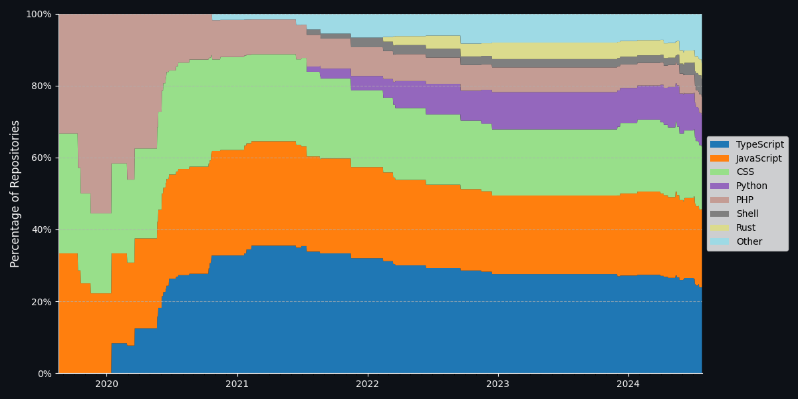
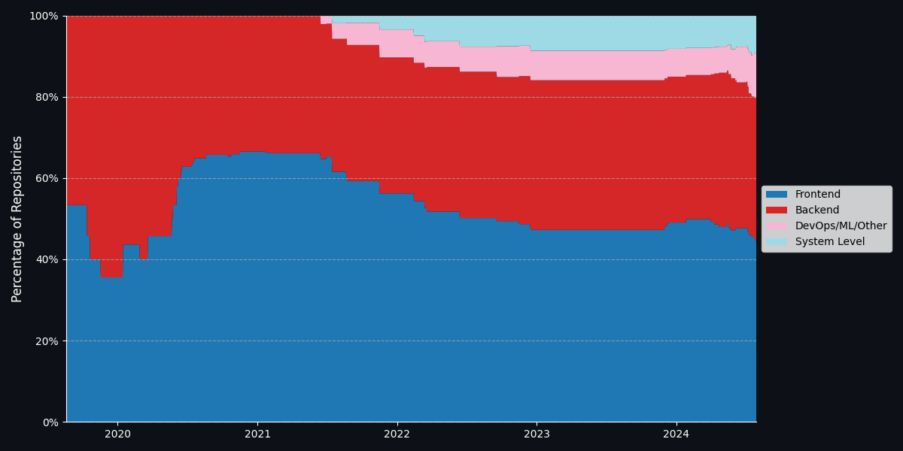
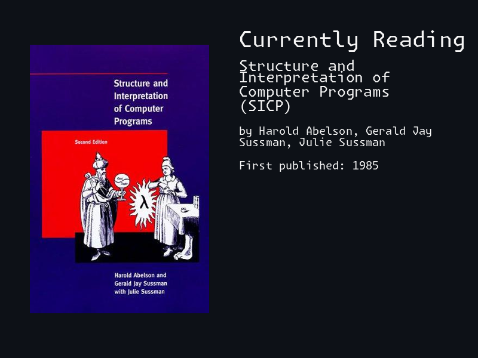

<pre>
 ______                     _         __                     
|_   _ `.                  (_)       [  |       
  | | `. \ ,--.   _ .--.   __  .---.  | |         _            ___  _               _     
  | |  | |`'_\ : [ `.-. | [  |/ /__\\ | |      __| | _  _     | _ \| | ___  ___ ___(_) ___
 _| |_.' /// | |, | | | |  | || \__., | |     / _` || || |    |  _/| |/ -_)(_-<(_-<| |(_-<
|______.' \'-;__/[___||__][___]'.__.'[___]    \__,_| \_,_|    |_|  |_|\___|/__//__/|_|/__/
</pre>

Interested in learning more about me?
And... do you like graphs?

I sure hope so!

Here's a small window into my repositories - public and private - and how they've changed over the years:

<picture>
  <source media="(prefers-color-scheme: light)" srcset="https://raw.githubusercontent.com/DanielDuP/DanielDuP/master/media/repo_languages_light_mode.png">
  
</picture>

(Yes, I wrote a lot of php back in the day - no, I didn't know better. Also php >8 is pretty great, fight me.)

Or, if you'd like to know what _kind_ of projects these were:

<picture>
  <source media="(prefers-color-scheme: light)" srcset="https://raw.githubusercontent.com/DanielDuP/DanielDuP/master/media/repo_areas_light_mode.png">
  
</picture>

I'm working through an ever growing reading list - please feel free to drop some recommendations!

<picture>
  <source media="(prefers-color-scheme: light)" srcset="https://raw.githubusercontent.com/DanielDuP/DanielDuP/master/media/currently_reading_light_mode.png">
  
</picture>

[(Updated daily from OpenLibrary)](https://openlibrary.org/)
